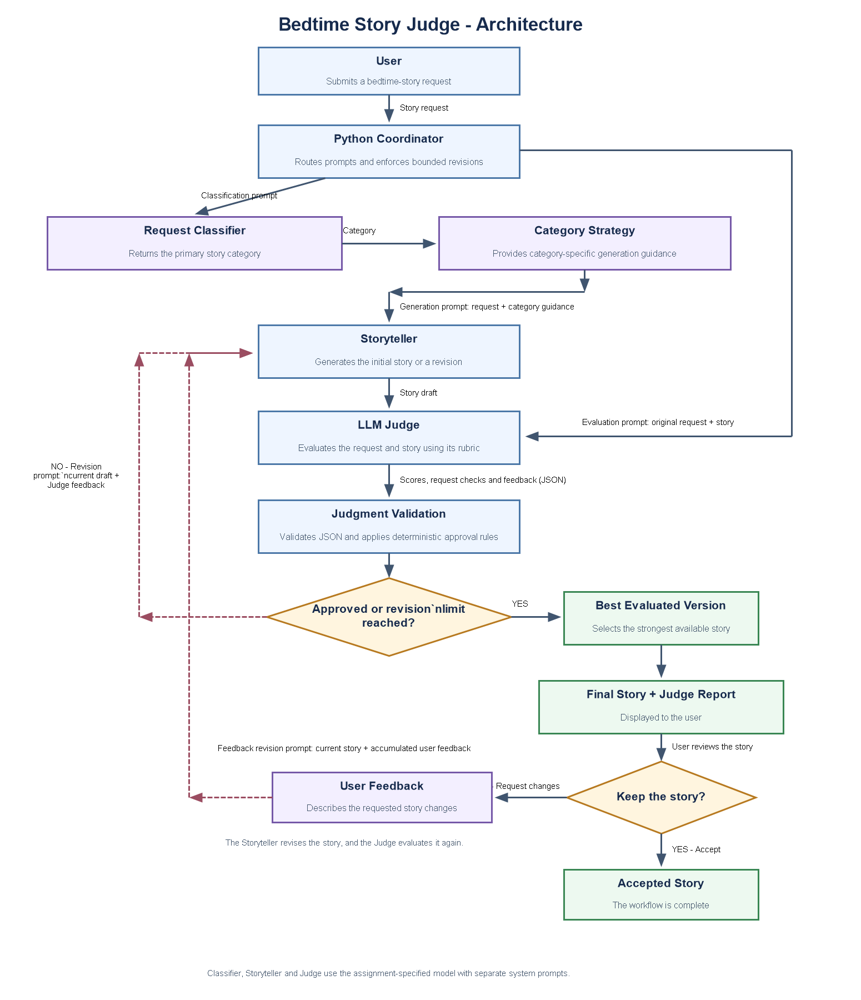

# LLM Bedtime Story Judge

An agentic Python command-line application that creates bedtime stories for
children ages 5–10, evaluates them with an LLM Judge, and improves weak drafts
before showing the best version to the user.

The project was built for the Hippocratic AI coding assignment. It keeps the
assignment-provided `gpt-3.5-turbo` model and differentiates the application’s
LLM roles through focused system prompts and task-specific prompt templates.

## Features

- Classifies each request into a primary story category.
- Applies a category-specific storytelling strategy.
- Generates warm, age-appropriate bedtime stories.
- Evaluates stories against seven quality and safety criteria.
- Checks every explicit user requirement with evidence.
- Automatically revises drafts that do not meet the approval rules.
- Retains evaluated drafts and returns the strongest version.
- Accepts user-requested changes and evaluates the updated story again.
- Validates structured LLM responses and retries one malformed Judge response.
- Includes automated tests that do not require live OpenAI API calls.

## Architecture



The workflow is intentionally bounded. A story can receive at most two automatic
revisions, and the user can provide at most two feedback rounds. These limits keep
the CLI predictable and prevent uncontrolled LLM loops.

### Major components

| Component | Responsibility |
| --- | --- |
| `main.py` | Runs the command-line experience and coordinates user interaction. |
| `prompts.py` | Stores the system prompts, task prompt builders, and fixed category strategies. |
| `utils.py` | Implements classification, generation, evaluation, revision, selection, parsing, and display helpers. |
| `call_llm.py` | Provides the single OpenAI API boundary used by every LLM role. |
| `config.py` | Loads environment configuration and centralizes model, temperature, token, retry, and revision settings. |
| `ResponseModel/` | Contains the structured models used for classification, Judge output, evaluated drafts, and final results. |
| `tests/` | Tests prompt construction, parsing, orchestration, retry behavior, classification, feedback, and model calls. |

### LLM roles

The application uses the same assignment-required model for three distinct roles:

1. **Request Classifier** — selects one primary category: adventure, comfort,
   educational, fantasy, humorous, values, or everyday.
2. **Storyteller** — generates the initial story and performs both Judge-directed
   and user-directed revisions. Revision is a separate task prompt, not a separate
   LLM identity.
3. **Judge** — evaluates the story independently, returns structured JSON, and
   supplies evidence and actionable revision instructions.

The Python coordinator is deterministic application logic rather than another LLM
agent. It validates outputs, applies approval rules, enforces iteration limits, and
selects the best evaluated draft.

## Design decisions

### Simple Python instead of an agent framework

The workflow has a small, known set of steps and only one model provider. Plain
Python makes prompt flow, state, retry behavior, and stopping conditions explicit
without adding framework abstractions that are unnecessary for this assignment.
The role separation and feedback loops still provide agentic behavior.

### Centralized, role-specific prompts

All system prompts and prompt builders live in `prompts.py`. Keeping prompts out of
the orchestration code makes each role easier to inspect, explain, test, and tune.
Untrusted story requests and generated text are placed inside clearly labeled XML
sections so they are treated as content rather than role-changing instructions.

### Category-specific generation

The classifier chooses a single primary category at low temperature. Python then
maps that category to a fixed strategy instead of asking the model to invent a
strategy. This makes the behavior more consistent while still tailoring story arcs
to the user’s intent.

### Structured, evidence-based judging

The Judge returns JSON containing:

- atomic request checks with evidence;
- integer scores from 1–5 for age appropriateness, bedtime suitability, request
  adherence, story structure, creativity, clarity, and safety;
- strengths, issues, and revision instructions.

Python validates the schema and applies deterministic approval rules. A story is
approved only when all explicit requirements pass, the key age/bedtime/adherence/
safety scores are at least 4, every remaining score is at least 3, and the average
score is at least 4.0.

### Bounded revision and best-draft selection

Judge feedback is returned to the Storyteller for at most two automatic revisions.
Every evaluated version is retained. The final version is selected with a
safety-first ranking that prioritizes approval, hard-requirement compliance, fewer
failed request checks, the minimum criterion score, and then the average score.
This avoids assuming that the last revision is always the best one.

### User feedback remains part of evaluation

After seeing a story, the user can keep it or request changes. Feedback is retained
in chronological rounds, with later feedback taking precedence when requests
conflict. The updated story is judged against both the original request and the
accumulated feedback, so a requested edit is not treated as successful merely
because a new draft was generated.

### Secrets and configuration

The OpenAI key is loaded from `.env`, which is excluded by `.gitignore`.
`.env.example` contains only the variable name and a safe placeholder and can be
committed to GitHub. Runtime settings are centralized in `config.py`; the required
model name is intentionally fixed there.

## Requirements

- Python 3.9 or newer
- An OpenAI API key with available API credits

## Setup

Clone the repository and move into it:

```bash
git clone <repository-url>
cd llm-bedtime-story-judge
```

Create and activate a virtual environment.

Windows PowerShell:

```powershell
py -m venv .venv
.\.venv\Scripts\Activate.ps1
```

macOS or Linux:

```bash
python3 -m venv .venv
source .venv/bin/activate
```

Install the dependencies:

```bash
pip install -r requirements.txt
```

Create the local environment file from the example:

Windows PowerShell:

```powershell
Copy-Item .env.example .env
```

macOS or Linux:

```bash
cp .env.example .env
```

Open `.env` and replace the placeholder with your key:

```dotenv
OPENAI_API_KEY=your_actual_openai_api_key
```

Never commit `.env` or a real API key.

## Run the application

From the repository root, run:

```bash
python main.py
```

On Windows, `py main.py` can be used if `python` is not registered as a command.

Example request:

```text
A little rabbit learns not to be afraid of thunderstorms.
```

The application will display the selected category, generate and judge the story,
perform any required bounded revisions, show the selected version and Judge report,
and then ask whether the user wants to keep the story or request a change.

## Run the tests

```bash
pytest
```

The test suite mocks the model boundary, so running the tests does not consume API
credits or require network access.
